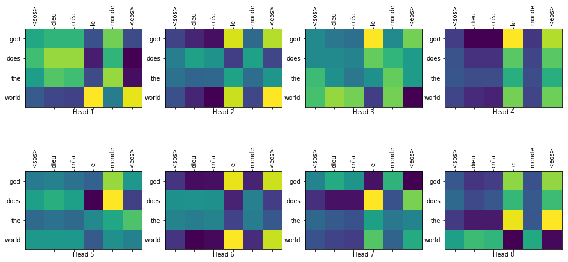
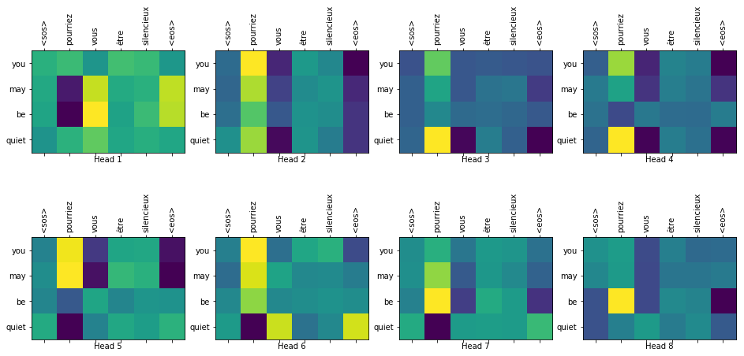

# Introduction

An implementation of the model described in the [Attention is all you need](https://arxiv.org/abs/1706.03762). My notes of the paper and other blogs can be found in the [wiki](https://github.com/uzi0espil/research-papers-implementation/wiki/attention-is-all-you-need).

# Run

Please first make sure you have the requirement libraries installed.

~~~
pip install -r requirements.txt
~~~

There are two versions of the model:

- `run.ipynb`: A custom training loop in tensorflow. (Contains insights on how to visualize the attention weights)
- `run-v2.ipynb`: Using keras `fit` function to train the model.

For experimenting, you can control the model's parameters by configuring `config.json` file, feel free to modify it based on your device's capabilities.

# Positional Encoder

For further insights about how Positional Encoder layer works, then you can look at `positional_encoder.ipynb` notebook.

# Results:

Here are some samples from the testing set, the figure shows the 8 heads of attention weights of the Decoder's 6th layer and 2nd block. 

**Example 1**
Input: dieu créa le monde
Actual translation: god created the world
Predicted translation: god does the world
    

    
**Example 2**
Input: <sos> pourriez vous être silencieux <eos>
Actual translation: <sos> could you please be quiet <eos>
Predicted translation: you may be quiet

    
# Things to add:
    
- Use Beam Search.
- Use keras.lambda on every tf operation so that we can save the model. Then, we can load the model and add attention layer output to visualize the attention weights.
    
# References and Further Resources

- [Attention is all you need](https://arxiv.org/abs/1706.03762)
- [Tensorflow Transformer tutorial](https://www.tensorflow.org/tutorials/text/transformer)
- [The illustrated Transformer](http://jalammar.github.io/illustrated-transformer/)
- [Hands-on ML with Scikit-learn, keras and Tensorflow](https://github.com/ageron/handson-ml2)
- [Python BLEU Score implementation](https://github.com/tensorflow/nmt/blob/master/nmt/scripts/bleu.py)