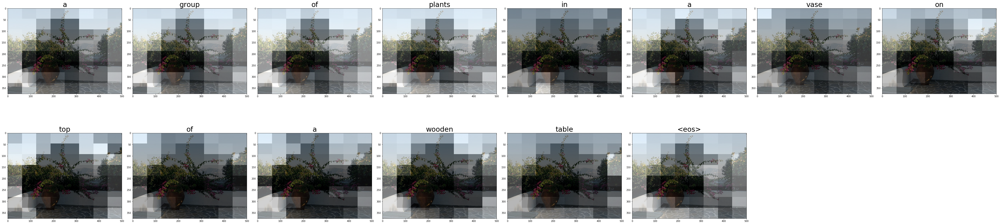

# Show, Attend and Tell

An implementation of the model described in the paper. Some notes of the paper can be found in the [wiki](https://github.com/uzi0espil/research-papers-implementation/wiki/show-attend-tell).

The model is trained on [MS-COCO2014 dataset](http://cocodataset.org/#home), it contains over than 82K images, each of which has several captions.

## Run

Please first make sure you have the requirement libraries installed.

~~~
pip install -r requirements.txt
~~~

There are two version of the model:

- `run.ipynb`: A custom training loop in tensorflow. You can run Luong or Bahdanau Attention.
- `run-v2.ipynb`: Use keras fit function to train the model. Only Luong attention is used.

For experimenting, you can control the model's parameters by configuring `config.json` file, feel free to modify it based on your device's capabilities.

## Results

The trained model is overfitting the validation data, nevertheless, here are some random results from the model:

Real captions: ['long stemmed plant with flowers white wall and stone floor', 'a patio with a view and flowers on it', 'a brown vase holding a green flower filled plant next to a short white wall', 'a tall potted plant is in the corner outside', 'potted plant with pink flowers on a stone area outside']

Real captions: ['a man holding a tennis racquet on top of a tennis court', 'a boy that is playing tennis and holding a racquet in his hand', 'a man swinging a tennis racquet at a ball on a court', 'a man in a cut off tee shirt about to hit a tennis ball', 'a man is preparing to hit a ball in a tennis court']

## References and Further Readings

- [Show, Attend and Tell: Neural Image Caption Generation with Visual Attention](https://arxiv.org/abs/1502.03044)
- [Image Captioning with Attention](https://www.tensorflow.org/tutorials/text/image_captioning)
- [Hands-on Machine Learning With Scikit-Learn, Keras & Tensorflow](https://github.com/ageron/handson-ml2)
- [Python BLEU Score implementation](https://github.com/tensorflow/nmt/blob/master/nmt/scripts/bleu.py)