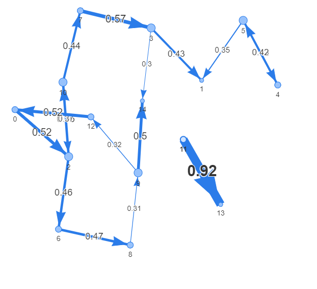
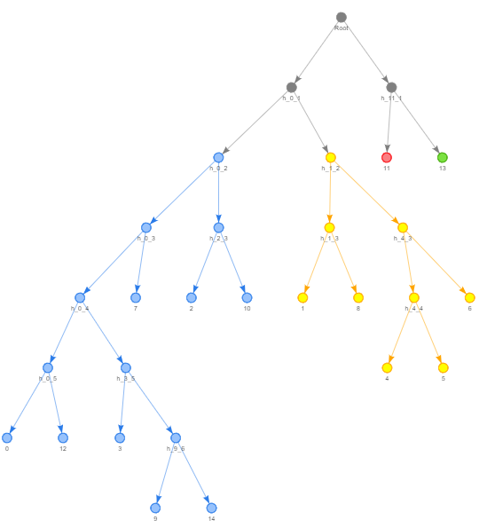
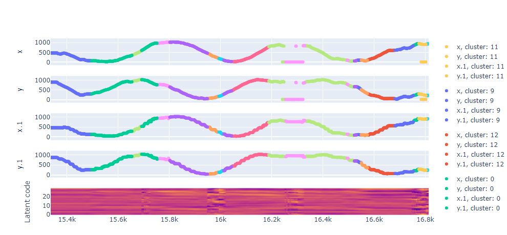

<!-- #region -->
# Introduction

An implementation for the model described in [Identifying Behavioral Structure From Deep Variational Embeddings Of Animal Motion](https://www.biorxiv.org/content/10.1101/2020.05.14.095430v1.full.pdf) Trained on the Dataset provided by the paper. The notes of the paper and other related methods can be found in the [wiki](https://github.com/uzi0espil/research-papers-implementation/wiki/Variational-Embeddings-Animal-Motion).

# Run

First install the required libraries:

~~~shell
pip install -r requirement.txt
~~~

Then, play with `run.ipynb`. The experiment and model paramaters can be controlled from `config.json`.

# Results

Here is the the generated Markov Transition Graph on the data provided in the paper (filtering edges under 0.3).

 

Converting the graph to binary tree and cut the tree at level two to detect communities:

Finally, here are the cluster of the time series along with the latent code

# Reference and Further Resources

- [Temporal Neighborhood Coding](https://www.biorxiv.org/content/10.1101/2020.05.14.095430v1.full.pdf)
- [Original Code in pytorch](https://github.com/LINCellularNeuroscience/VAME)
<!-- #endregion -->
