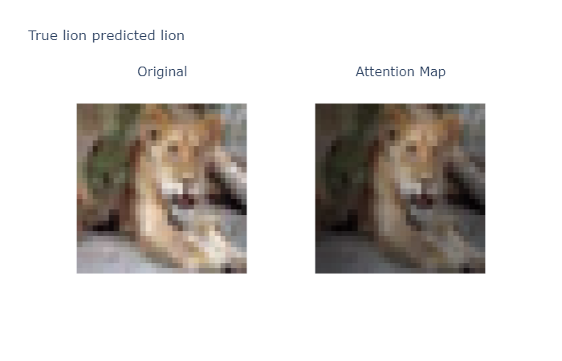
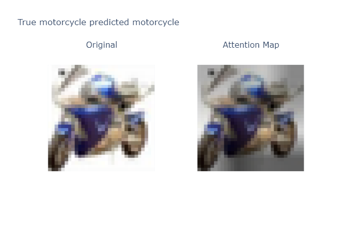
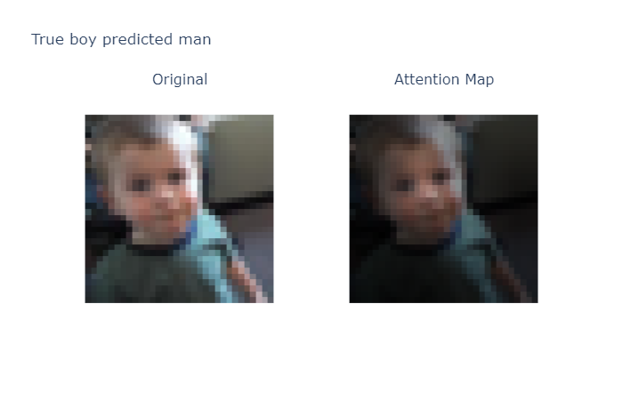
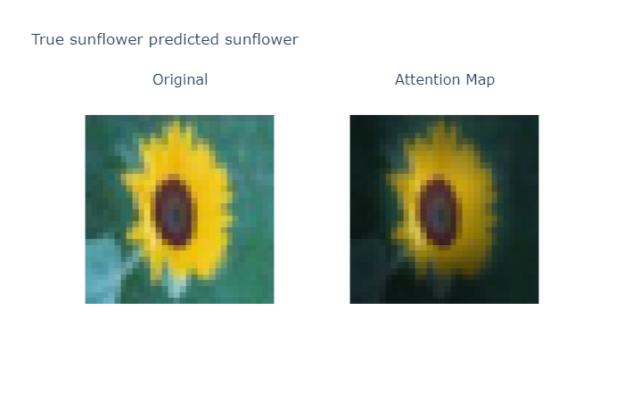

<!-- #region -->
# Introduction

An implementation for the model described in [An Image Is Worth 16X16 Words Transformers For Image Recognition At Scale](https://arxiv.org/pdf/2010.11929.pdf)
Trained and tested on CIFAR100 dataset. The notes of the paper and other related methods can be found in the [wiki](https://github.com/uzi0espil/research-papers-implementation/wiki/Vision-Transformer).

# Run

First install the required libraries:

~~~shell
pip install -r requirement.txt
~~~

Then, play with `run.ipynb`. The experiment and model paramaters can be controlled from `config.json`.

# Results

Representative examples of attention from output token to the input space:

sample 1374 from test set:

sample 2066 from test set:

sample 3068 from test set:

sample 6647 from test set:

# Reference and further reading

- [Vision Transformer](https://arxiv.org/pdf/2010.11929.pdf)
- [Big Transfer](https://arxiv.org/pdf/1912.11370.pdf)
- [Yannic Kilcher explanation](https://www.youtube.com/watch?v=TrdevFK_am4&t=1463s&ab_channel=YannicKilcher)
- [Keras-vit](https://github.com/faustomorales/vit-keras)
<!-- #endregion -->
